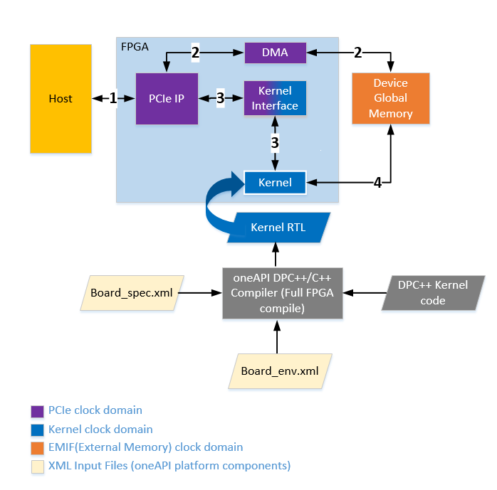

# Board Test
This design contains tests to check FPGA board interfaces and reports the following metrics:
1. Host to device global memory interface bandwidth
2. Kernel clock frequency
3. Kernel launch latency
4. Kernel to device global memory bandwidth

***Documentation***:  The [DPC++ FPGA Code Samples Guide](https://software.intel.com/content/www/us/en/develop/articles/explore-dpcpp-through-intel-fpga-code-samples.html) helps you to navigate the samples and build your knowledge of DPC++ for FPGA. <br>
The [oneAPI DPC++ FPGA Optimization Guide](https://software.intel.com/content/www/us/en/develop/documentation/oneapi-fpga-optimization-guide) is the reference manual for targeting FPGAs through DPC++. <br>
The [oneAPI Programming Guide](https://software.intel.com/en-us/oneapi-programming-guide) is a general resource for target-independent DPC++ programming.

| Optimized for                     | Description
---                                 |---
| OS                                | Linux* Ubuntu* 18.04/20.04, RHEL*/CentOS* 8, SUSE* 15
| Hardware                          | Intel® Programmable Acceleration Card (PAC) with Intel Arria® 10 GX FPGA <br> Intel® FPGA Programmable Acceleration Card (PAC) D5005 (with Intel Stratix® 10 SX) <br> Intel® FPGA 3rd party / custom platforms with oneAPI support <br> *__Note__: Intel® FPGA PAC hardware is only compatible with Ubuntu 18.04* 
| Software                          | Intel® oneAPI DPC++ Compiler <br> Intel® FPGA Add-On for oneAPI Base Toolkit
| What you will learn               | How to test board interfaces to ensure designed platform provides expected performance
| Time to complete                  | 30 minutes (not including compile time)

## Purpose
This test can be used to check FPGA board interfaces and measure host to device as well as kernel to global memory interface metrics. Custom platform developers can use this test as a starting point to validate custom platform interfaces. 

### Introduction to oneAPI FPGA Platform 

Block diagram below shows an overview of oneAPI FPGA platform interfaces. The numbered arrows depict the following:
* Path 1 + 2 depicts the host to device global memory interface
* Path 1 + 3 depicts the host to kernel interface 
* Path 4 shows the kernel to device global memory interface

The kernel clock domain is of importance to note for this sample. `board_test` measures and reports kernel clock frequency. [Test Details](#test-details) section provides more information.



*Note:* The block diagram shown above is an overview of a typical oneAPI FPGA platform. Please refer to oneAPI platform vendor documentation for more details on platform components. 

### Test Details
The complete test exercises following interfaces in a platform:
1. **Host to device global memory interface:** This interface is checked by performing explicit data movement between the host and device global memory. Host to device global memory bandwidth is measured and reported. As a part of this interface check, unaligned data transfers are also performed to verify non-DMA transfers complete successfully.

2. **Kernel to device global memory interface:** This interfaces is checked by performing kernel to memory data transfers using simple read & write kernels. Kernel to memory bandwidth is measured and reported. 
*Note:* This test currently does not support SYCL Unified Shared Memory (USM). For testing USM interface, please use [Simple host streaming sample](https://github.com/oneapi-src/oneAPI-samples/tree/master/DirectProgramming/DPC%2B%2BFPGA/Tutorials/DesignPatterns/simple_host_streaming).

3. **Host to kernel interface:** The test ensures the host to kernel communication is correct and host can launch a kernel successfully. It also measures the roundtrip kernel launch latency and throughput (number of kernel/ms) of single task no-operation kernels.

In addition to above interface checks, the test also measures the following metric:
1. **Kernel clock frequency:** The test measures the frequency that the programmed kernel is running at on the FPGA device and reports it. By default, this test fails if the measured frequency is not within 2% of the compiled frequency.
*Note:* The test allows overriding this failure, however, this is may lead to functional errors and is not recommended. The override option is provided to allow debug in case where platform design changes are done to force kernel to run at slower clock (not common use-case). Usage section describes how to override this option if required. 

These interface checks are divided into six sub-tests. By default, all tests are run. User can select the test to run using `-test=<test number>` option while running the executable. Please see [Running the Sample](#running-the-sample) for test usage instructions. 
1. Host Speed and Host Read Write Test
2. Kernel Clock Frequency Test
3. Kernel Launch Test
4. Kernel Latency Measurement
5. Kernel-to-Memory Read Write Test
6. Kernel-to-Memory Bandwidth Test
*Note:* It is recommended to run all tests at least once to ensure the for a platform interfaces are fully functional.

## Key Concepts
* Sample to demonstrate platform interface checks

## License  
Code samples are licensed under the MIT license. See
[License.txt](https://github.com/oneapi-src/oneAPI-samples/blob/master/License.txt) for details.

Third party program Licenses can be found here: [third-party-programs.txt](https://github.com/oneapi-src/oneAPI-samples/blob/master/third-party-programs.txt)

## Building the `board_test` code sample

### Include Files
The included header `dpc_common.hpp` is located at `$ONEAPI_ROOT/dev-utilities/latest/include` on your development system.

### Running Samples in DevCloud
If running a sample in the Intel DevCloud, remember that you must specify the type of compute node and whether to run in batch or interactive mode. Compiles to FPGA are only supported on fpga_compile nodes. Executing programs on FPGA hardware is only supported on fpga_runtime nodes of the appropriate type, such as fpga_runtime:arria10 or fpga_runtime:stratix10.  Neither compiling nor executing programs on FPGA hardware are supported on the login nodes. For more information, see the Intel® oneAPI Base Toolkit Get Started Guide ([https://devcloud.intel.com/oneapi/documentation/base-toolkit/](https://devcloud.intel.com/oneapi/documentation/base-toolkit/)).

When compiling for FPGA hardware, it is recommended to increase the job timeout to 12h.

### On a Linux* System

1. Generate the `Makefile` by running `cmake`.
     ```
   mkdir build
   cd build
   ```
   To compile for the Intel® PAC with Intel Arria® 10 GX FPGA, run `cmake` using the command:
    ```
    cmake ..
   ```
   Alternatively, to compile for the Intel® FPGA PAC D5005 (with Intel Stratix® 10 SX), run `cmake` using the command:

   ```
   cmake .. -DFPGA_BOARD=intel_s10sx_pac:pac_s10
   ```
   You can also compile for a custom FPGA platform. Ensure that the board support package is installed on your system. Then run `cmake` using the command:
   ```
   cmake .. -DFPGA_BOARD=<board-support-package>:<board-variant>
   ```

2. Compile the design through the generated `Makefile`. The following build targets are provided, matching the recommended development flow:

   * Compile for [emulation](#fpga-emulator) (compiles quickly, targets emulated FPGA device):
      ```
      make fpga_emu
      ```
   * Generate the [optimization report](#optimization-report): 
     ```
     make report
     ```
   * Compile for [FPGA hardware](#fpga-hardware) (takes longer to compile, targets FPGA device):
     ```
     make fpga
     ```
3. (Optional) As the above hardware compile may take several hours to complete, FPGA pre-compiled binaries (compatible with Linux* Ubuntu* 18.04) can be downloaded <a href="https://iotdk.intel.com/fpga-precompiled-binaries/latest/board_test.fpga.tar.gz" download>here</a>.

### In Third-Party Integrated Development Environments (IDEs)

You can compile and run this tutorial in the Eclipse* IDE (in Linux*). For instructions, refer to the following link: [Intel® oneAPI DPC++ FPGA Workflows on Third-Party IDEs](https://software.intel.com/en-us/articles/intel-oneapi-dpcpp-fpga-workflow-on-ide)


## Examining the Reports
Locate `report.html` in the `board_test.prj/reports/` directory. Open the report in any of Chrome*, Firefox*, Edge*, or Internet Explorer*.

You may also wish to examine the reports generated by the full FPGA hardware compile and compare their contents.

## Running the Sample

 1. Run the sample on the FPGA emulator (the kernel executes on the CPU):
     ```
     ./board_test.fpga_emu     (Linux)
     ```
2. Run the sample on the FPGA device:
     ```
     ./board_test.fpga         (Linux)
     ```
The above commands run all the test described in [Test Details](#test-details), to run a specific test pass the test number as argument to `-test=<test number>` option: 
     ```
    ./board_test.fpga -test=<test number>     (Linux)
     ```
`Test number` should be one of the following:
1. Host Speed and Host Read Write Test
2. Kernel Clock Frequency Test
3. Kernel Launch Test
4. Kernel Latency Measurement
5. Kernel-to-Memory Read Write Test
6. Kernel-to-Memory Bandwidth Test

This test has 2 additional requirements to run successfully. 

1. Requirement for the kernel clock frequency test: The reports directory (generated after full compilation) must be in one of the following locations:
* Same directory as board_test.fpga binary
* Inside board_test.prj folder in the same directory as board_test.fpga binary
If the reports folder is not found, the test will return the measured kernel clock frequency and fail, none of the other tests will run as hardware frequency may not be the expected value. Continuing to run other tests may lead to functional errors.
*Note:* The test allows overriding this failure, however, this is may lead to functional errors and is not recommended. The override option is provided to allow debug in case where platform design changes are done to force kernel to run at slower clock (not common use-case). To override, set `report_chk` variable to `false` in `board_test.cpp` and recompile host code only using `-reuse-exe=board_test.fpga` option in compile command.

2. Requirement for kernel-to-memory bandwidth test: Export OFS_OCL_SHIM_ROOT_HW to point to `path-to-oneAPI-shim/hardware/<board_variant>` directory. The test looks for `board_spec.xml` file in this folder to get the global memory information for the board. The test does not fail if this variable is not set, it reports measured kernel to device global memory bandwidth numbers and continues. 

To view test details and usage information using the binary, use `-help` option.
     ```
     ./board_test.fpga -help      (Linux)
     ```

### Example of Output
Running on FPGA device (Intel Stratix 10 SX platform):
```
*** Board_test usage information ***
Command to run board_test using generated binary:
  > To run all tests (default): ./board_test.fpga
  > To run a specific test (see list below); pass the test number as argument to "-test" option: ./board_test.fpga -test=<test_number>
  > To see more details on what each test does: ./board_test.fpga -help
The tests are:
  1. Host Speed and Host Read Write Test
  2. Kernel Clock Frequency Test
  3. Kernel Launch Test
  4. Kernel Latency Measurement
  5. Kernel-to-Memory Read Write Test
  6. Kernel-to-Memory Bandwidth Test
Note: Kernel Clock Frequency is run along with all tests except 1 (Host Speed and Host Read Write test)

Running all tests 
Running on device: pac_s10 : Intel PAC Platform (pac_ef00000)

clGetDeviceInfo CL_DEVICE_GLOBAL_MEM_SIZE = 34359737344
clGetDeviceInfo CL_DEVICE_MAX_MEM_ALLOC_SIZE = 34359737344
Device buffer size available for allocation = 34359737344 bytes

*****************************************************************
*********************** Host Speed Test *************************
*****************************************************************

Size of buffer created = 34359737344 bytes
Writing 32767 MB to device global memory ... 8268.17 MB/s
Reading 32767 MB from device global memory ... 7139.5 MB/s
Verifying data ...
Successfully wrote and readback 32767 MB buffer

Transferring 8192 KBs in 256 32 KB blocks ...
Transferring 8192 KBs in 128 64 KB blocks ...
Transferring 8192 KBs in 64 128 KB blocks ...
Transferring 8192 KBs in 32 256 KB blocks ...
Transferring 8192 KBs in 16 512 KB blocks ...
Transferring 8192 KBs in 8 1024 KB blocks ...
Transferring 8192 KBs in 4 2048 KB blocks ...
Transferring 8192 KBs in 2 4096 KB blocks ...
Transferring 8192 KBs in 1 8192 KB blocks ...

Writing 8192 KBs with block size (in bytes) below:

Block_Size Avg Max Min End-End (MB/s)
   32768 1292.53 1648.29 271.99 1035.71 
   65536 1879.23 2606.45 464.84 1616.45 
  131072 2708.05 3656.79 890.22 2398.33 
  262144 3297.29 4544.88 1441.76 3091.73 
  524288 3846.32 4774.32 2275.74 3723.38 
 1048576 4232.86 4942.01 2781.87 4170.92 
 2097152 4325.23 4963.80 3414.84 4292.27 
 4194304 4896.67 5144.84 4671.35 4878.59 
 8388608 5661.12 5661.12 5661.12 5661.12 

Reading 8192 KBs with block size (in bytes) below:

Block_Size Avg Max Min End-End (MB/s)
   32768 2168.82 2377.87 499.50 1466.44 
   65536 2947.77 3269.68 803.59 2177.28 
  131072 3754.72 4084.30 1444.42 3181.48 
  262144 4241.89 4648.48 2305.29 3930.01 
  524288 4536.16 4967.17 3086.69 4365.66 
 1048576 4776.32 4892.39 4543.47 4682.50 
 2097152 4468.34 4766.13 3994.57 4441.95 
 4194304 5294.06 5572.75 5041.92 5274.10 
 8388608 5819.58 5819.58 5819.58 5819.58 

Host write top speed = 5661.12 MB/s
Host read top speed = 5819.58 MB/s


HOST-TO-MEMORY BANDWIDTH = 5740 MB/s


*****************************************************************
********************* Host Read Write Test **********************
*****************************************************************

--- Running host read write test with device offset 0
--- Running host read write test with device offset 3

HOST READ-WRITE TEST PASSED!

*****************************************************************
*******************  Kernel Clock Frequency Test  ***************
*****************************************************************

*** NOTE ***: This test expects the reports folder generated during compile to be in one of the following locations : 
    1. Same directory as board_test.fpga binary
    2. Inside board_test.prj folder in the same directory as board_test.fpga binary
    If the reports folder is not found, the test will return only the measured kernel frequency and fail, none of the other tests will run as hardware frequency may not be the expected value and may lead to functional errors.
    If you wish to override this failure, please set "report_chk" variable to "false" in <board_test.cpp> and recompile host code only using "-reuse-exe=board_test.fpga" option in compile command.
    Please run complete board_test and ensure the hardware frequency matches expected frequency, mismatch may lead to functional error.

Measured Frequency    =   381.443 MHz 
Quartus Compiled Frequency  =   382 MHz 

Measured Clock frequency is within 2 percent of quartus compiled frequency. 

*****************************************************************
********************* Kernel Launch Test ************************
*****************************************************************

Launching kernel KernelSender ...
Launching kernel KernelReceiver ...
  ... Waiting for sender
Sender sent the token to receiver
  ... Waiting for receiver

KERNEL_LAUNCH_TEST PASSED

*****************************************************************
********************  Kernel Latency  **************************
*****************************************************************

Processed 10000 kernels in 170.2829 ms
Single kernel round trip time = 17.0283 us
Throughput = 58.7258 kernels/ms
Kernel execution is complete

*****************************************************************
*************  Kernel-to-Memory Read Write Test  ***************
*****************************************************************

Maximum device global memory allocation size is 34359737344 bytes 
Finished host memory allocation for input and output data
Creating device buffer
Finished writing to device buffers 
Launching kernel MemReadWriteStream ... 
Launching kernel with global offset : 0
Launching kernel with global offset : 1073741824
Launching kernel with global offset : 2147483648
Launching kernel with global offset : 3221225472
Launching kernel with global offset : 4294967296
Launching kernel with global offset : 5368709120
Launching kernel with global offset : 6442450944
Launching kernel with global offset : 7516192768
... kernel finished execution. 
Finished Verification
KERNEL TO MEMORY READ WRITE TEST PASSED 

*****************************************************************
*****************  Kernel-to-Memory Bandwidth  *****************
*****************************************************************

Note: This test assumes that design was compiled with -Xsno-interleaving option

Size of memory bank 1 = 0x200000000 bytes 
Size of memory bank 2 = 0x200000000 bytes 
Size of memory bank 3 = 0x200000000 bytes 
Size of memory bank 4 = 0x200000000 bytes 

Performing kernel transfers of 4096 MBs on the default global memory (address starting at 0)
Launching kernel MemWriteStream ... 
Launching kernel MemReadStream ... 
Launching kernel MemReadWriteStream ... 

Summarizing bandwidth in MB/s/bank for banks 1 to 4
 17086.7  17086.8  17086.6  17086.6  MemWriteStream
 17339.7  17340  17339.9  17339.8  MemReadStream
 16259.4  16259.5  16259.4  16258.9  MemReadWriteStream

Name of the global memory type      :    DDR
Number Of Interfaces            :    4
Max Bandwidth (all memory interfaces)   :    76800 MB/s 
Max Bandwidth of 1 memory interface in board_spec.xml :    19200 MB/s 

It is assumed that all memory interfaces have equal widths. 

BOARD BANDWIDTH UTILIZATION = 87.9962
Warning : Board bandwidth utilization is less than 90% 

KERNEL-TO-MEMORY BANDWIDTH = 16895.3 MB/s/bank

BOARD TEST PASSED
 
```
