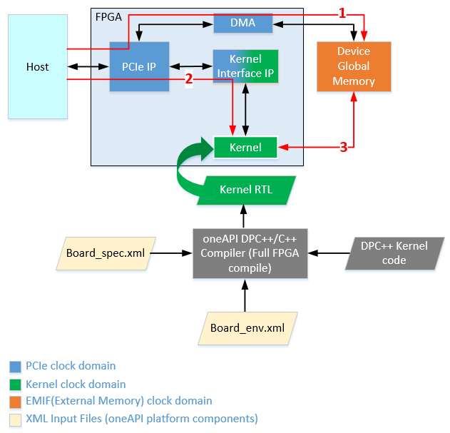

# Board Test
This design contains tests to check FPGA board interfaces and reports the following metrics:
* Host to device global memory interface bandwidth
* Kernel clock frequency
* Kernel launch latency
* Kernel to device global memory bandwidth

***Documentation***:  The [DPC++ FPGA Code Samples Guide](https://software.intel.com/content/www/us/en/develop/articles/explore-dpcpp-through-intel-fpga-code-samples.html) helps you navigate the samples and build your knowledge on SYCL* for FPGA. <br>
The [FPGA Optimization Guide for Intel® oneAPI Toolkits](https://software.intel.com/content/www/us/en/develop/documentation/oneapi-fpga-optimization-guide) is the reference manual for targeting FPGAs through SYCL*. <br>
The [oneAPI Programming Guide](https://software.intel.com/en-us/oneapi-programming-guide) is a general resource for target-independent DPC++ programming.

| Optimized for                     | Description
---                                 |---
| OS                                | Linux* Ubuntu* 18.04/20.04, RHEL*/CentOS* 8, SUSE* 15
| Hardware                          | Intel® Programmable Acceleration Card (PAC) with Intel Arria® 10 GX FPGA <br> Intel® FPGA Programmable Acceleration Card (PAC) D5005 (with Intel Stratix® 10 SX) <br> Intel® FPGA third-party or custom platforms with oneAPI support <br> *__Note__: Intel® FPGA PAC hardware is compatible only with Ubuntu 18.04*
| Software                          | Intel® oneAPI DPC++/C++ Compiler <br> Intel® FPGA Add-On for oneAPI Base Toolkit
| What you will learn               | How to test board interfaces to ensure the designed platform provides expected performance
| Time to complete                  | 30 minutes (not including compile time)

## Purpose
You can use this test to check FPGA board interfaces and measure host to device and kernel to global memory interface metrics. Custom platform developers can use this test as a starting point to validate custom platform interfaces.

### Introduction to oneAPI FPGA Board Support Package (BSP)

A oneAPI BSP consists of software layers and an FPGA hardware scaffold design, making it possible to target an FPGA through the Intel® oneAPI DPC++/C++ Compiler. The compiler stitches the generated FPGA design into the oneAPI BSP framework. Refer to the [oneAPI Programming Guide](https://www.intel.com/content/www/us/en/develop/documentation/oneapi-programming-guide/top/programming-interface/fpga-flow/fpga-bsps-and-boards.html) for information about oneAPI BSPs. 

The BSP hardware components typically comprise RTL for all interfaces the oneAPI kernel requires, for example, a PCIe IP for the host to kernel communication, External Memory Interface (EMIF) IP for kernel to memory and host to FPGA board memory communication, and so on.

The BSP software components typically consist of a Memory Mapped Device (MMD) layer and a driver. The implementation is vendor-dependent.

The following block diagram shows an overview of a typical oneAPI FPGA BSP hardware design and the numbered arrows depict the following:
* Path 1 represents the host-to-device global memory interface.
* Path 2 represents the host to kernel interface.
* Path 3 represents the kernel-to-device global memory interface.

The BSP consists of components operating at different clock domains. PCIe and external memories operate at a fixed frequency. Corresponding RTL IPs are parametrized to operate at these fixed frequencies by platform vendors.
The kernel clock frequency varies and is calculated as part of the oneAPI offline compilation flow for FPGAs. The BSP has a logic to handle the data transfer across these clock domains.

`board_test` measures the frequency the kernel is running at in the FPGA and compares this to the compiled kernel clock frequency. [Test Details](#test-details) section provides more information.

***Note:*** The block diagram shown below is an overview of a typical oneAPI FPGA platform. Refer to the oneAPI platform or BSP vendor documentation for more details about platform components.



### Test Details
The complete test exercises following interfaces in a platform:
* **Host to device global memory interface:** This interface is checked by performing explicit data movement between the host and device global memory. Host to device global memory bandwidth is measured and reported. As a part of this interface check, unaligned data transfers are also performed to verify that non-DMA transfers complete successfully.

* **Kernel to device global memory interface:** This interface is checked by performing kernel to memory data transfers using simple read and write kernels. Kernel to memory bandwidth is measured and reported.<br> 
  ***Note:*** This test currently does not support SYCL Unified Shared Memory (USM). For testing the USM interface, use the [Simple host streaming sample](https://github.com/oneapi-src/oneAPI-samples/tree/master/DirectProgramming/DPC%2B%2BFPGA/Tutorials/DesignPatterns/simple_host_streaming).

* **Host to kernel interface:** The test ensures the host to kernel communication is correct and that the host can launch a kernel successfully. It also measures the roundtrip kernel launch latency and throughput (number of kernels/ms) of single task no-operation kernels.

In addition to the above interface checks, the test also measures **Kernel clock frequency**. The test measures the frequency the programmed kernel is running at on the FPGA device and reports it. By default, this test fails if the measured frequency is not within 2% of the compiled frequency.<br>
***Note:*** The test allows overriding this failure. However, this may lead to functional errors, and Intel does not recommend it. The override option allows debugging in case platform design changes force the kernel to run at a slower clock (this is not a common use case). The usage section describes how to override this option if required.

The complete board test is divided into six subtests. By default, all tests run. You can choose to run a single test by using the `-test=<test number>` option. Refer to the [Running the Sample](#running-the-sample) section for test usage instructions.
1. Host Speed and Host Read Write Test
2. Kernel Clock Frequency Test
3. Kernel Launch Test
4. Kernel Latency Measurement
5. Kernel-to-Memory Read Write Test
6. Kernel-to-Memory Bandwidth Test<br>
   
***Note:*** Intel recommends running all tests at least once to ensure that the platform interfaces are fully functional.

## Key Concepts
Sample to demonstrate platform interface checks

## License  
Code samples are licensed under the MIT license. See
[License.txt](https://github.com/oneapi-src/oneAPI-samples/blob/master/License.txt) for details.

You can find third-party program licenses here: [third-party-programs.txt](https://github.com/oneapi-src/oneAPI-samples/blob/master/third-party-programs.txt)

## Building the `board_test` Code Sample

### Include Files
The included header `dpc_common.hpp` is located at `$ONEAPI_ROOT/dev-utilities/latest/include` on your development system.

### Running Samples in DevCloud
If running a sample in the Intel DevCloud, specify the compute node type and whether to run in batch or interactive mode. 

***Note:*** Compiles to FPGA are supported only on `fpga_compile` nodes. Executing programs on FPGA hardware is supported only on `fpga_runtime` nodes of the appropriate type, such as `fpga_runtime:arria10` or `fpga_runtime:stratix10`. Neither compiling nor executing programs on FPGA hardware are supported on the login nodes. For more information, refer to the [Base Toolkit Getting Started Guide for Intel® DevCloud for oneAPI](https://devcloud.intel.com/oneapi/documentation/base-toolkit/).

When compiling for FPGA hardware, Intel recommends increasing the job timeout to 12h.

### On a Linux* System

1. Generate the `Makefile` by running `cmake`.
   ```
   mkdir build
   cd build
   ```
   To compile for the Intel® FPGA PAC D5005 (with Intel Stratix® 10 SX), run `cmake` using the command:
   ```
    cmake ..
   ```
   Alternatively, to compile for the Intel® PAC with Intel Arria® 10 GX FPGA, run `cmake` using the command:
   ```
   cmake -DFPGA_BOARD=intel_a10gx_pac:pac_a10 ..
   ```
   You can also compile for a custom FPGA platform. Ensure that the board support package is installed on your system. Then, run `cmake` using the command:
   ```
   cmake -DFPGA_BOARD=<board-support-package>:<board-variant> ..
   ```

2. Compile the design through the generated `Makefile`. The following build targets are provided, matching the recommended development flow:

   * Compile for emulation (compiles quickly, targets emulated FPGA device):
      ```
      make fpga_emu
      ```
   * Generate the optimization report: 
     ```
     make report
     ```
   * Compile for FPGA hardware (takes longer to compile, targets FPGA device):
     ```
     make fpga
     ```
3. (Optional) As the above hardware compile may take several hours to complete, you can download FPGA pre-compiled binaries (compatible with Linux* Ubuntu* 18.04) <a href="https://iotdk.intel.com/fpga-precompiled-binaries/latest/board_test.fpga.tar.gz" download>here</a>.

### In Third-Party Integrated Development Environments (IDEs)

You can compile and run this tutorial in the Eclipse* IDE (in Linux*). For instructions, refer to the following link:<br> [FPGA Workflows on Third-Party IDEs for Intel® oneAPI Toolkits](https://www.intel.com/content/www/us/en/developer/articles/technical/intel-oneapi-dpcpp-fpga-workflow-on-ide.html)

## Examining the Reports
Locate `report.html` in the `board_test.prj/reports/` directory and open the report in one of the following browsers: Chrome*, Firefox*, Edge*, or Internet Explorer*

You can also examine the reports generated by the full FPGA hardware compile and compare their contents.

## Running the Sample

 1. Run the sample on the FPGA emulator (the kernel executes on the CPU):
     ```
     ./board_test.fpga_emu     (Linux)
     ```
2. Run the sample on the FPGA device:
     ```
     ./board_test.fpga         (Linux)
     ```
The above commands run all tests described in [Test Details](#test-details). To run a specific test, pass the test number as an argument to the `-test=<test number>` option with: 
```
./board_test.fpga -test=<test_number>     (Linux)
```
The `test_number` should be one of the following:
1. Host Speed and Host Read Write Test
2. Kernel Clock Frequency Test
3. Kernel Launch Test
4. Kernel Latency Measurement
5. Kernel-to-Memory Read Write Test
6. Kernel-to-Memory Bandwidth Test

This test has the following additional requirements to run successfully: 

* **Requirement for the kernel clock frequency test:** The `reports` directory (generated after full compilation) must be in one of the following locations:
  * Same directory as the `board_test.fpga` binary.
  * Inside the `board_test.prj` folder in the same directory as the `board_test.fpga` binary.
  
  If the `reports` folder is not found, the test returns the measured kernel clock frequency and fails. None of the other tests run as hardware frequency may not be the expected value. Continuing to run other tests may lead to functional errors.<br>
  ***Note:*** The test allows overriding this failure. However, this may lead to functional errors, and Intel does not recommend it. The override option allows debugging in case platform design changes force the kernel to run at a slower clock (this is not a common use case). To override, set the `report_chk` variable to `false` in `board_test.cpp` and recompile only the host code by using the `-reuse-exe=board_test.fpga` option in your compile command.

* **Requirement for kernel-to-memory bandwidth test:** Export `HLD_SHIM_ROOT_HW` to point to the `path-to-oneAPI-shim/hardware/<board_variant>` directory. The test searches for the `board_spec.xml` file in this folder to obtain the global memory information for the board. The test does not fail if this variable is not set and reports measured kernel-to-device global memory bandwidth values and continue. 

To view test details and usage information using the binary, use the `-help` option.
```
./board_test.fpga -help      (Linux)
```

### Output Example
Running on FPGA device (Intel Stratix 10 SX platform):
```
*** Board_test usage information ***
Command to run board_test using generated binary:
  > To run all tests (default): ./board_test.fpga
  > To run a specific test (see list below); pass the test number as argument to "-test" option: ./board_test.fpga -test=<test_number>
  > To see more details on what each test does: ./board_test.fpga -help
The tests are:
  1. Host Speed and Host Read Write Test
  2. Kernel Clock Frequency Test
  3. Kernel Launch Test
  4. Kernel Latency Measurement
  5. Kernel-to-Memory Read Write Test
  6. Kernel-to-Memory Bandwidth Test
Note: Kernel Clock Frequency is run along with all tests except 1 (Host Speed and Host Read Write test)

Running all tests 
Running on device: pac_s10 : Intel PAC Platform (pac_f000001)

clGetDeviceInfo CL_DEVICE_GLOBAL_MEM_SIZE = 34359737344
clGetDeviceInfo CL_DEVICE_MAX_MEM_ALLOC_SIZE = 34359737344
Device buffer size available for allocation = 34359737344 bytes

*****************************************************************
*********************** Host Speed Test *************************
*****************************************************************

Size of buffer created = 34359737344 bytes
Writing 32767 MB to device global memory ... 7774.69 MB/s
Reading 32767 MB from device global memory ... 6584.19 MB/s
Verifying data ...
Successfully wrote and readback 32767 MB buffer

Transferring 8192 KBs in 256 32 KB blocks ...
Transferring 8192 KBs in 128 64 KB blocks ...
Transferring 8192 KBs in 64 128 KB blocks ...
Transferring 8192 KBs in 32 256 KB blocks ...
Transferring 8192 KBs in 16 512 KB blocks ...
Transferring 8192 KBs in 8 1024 KB blocks ...
Transferring 8192 KBs in 4 2048 KB blocks ...
Transferring 8192 KBs in 2 4096 KB blocks ...
Transferring 8192 KBs in 1 8192 KB blocks ...

Writing 8192 KBs with block size (in bytes) below:

Block_Size Avg Max Min End-End (MB/s)
   32768 1128.52 1557.28 286.21 892.39 
   65536 1740.38 2513.67 651.88 1480.86 
  131072 2352.17 3407.48 836.27 2093.22 
  262144 3431.90 4233.49 2185.98 3190.16 
  524288 3812.53 4848.16 3096.93 3667.55 
 1048576 4363.63 4875.98 3884.19 4280.78 
 2097152 4523.95 4882.84 4137.46 4489.17 
 4194304 5312.95 5323.40 5302.54 5290.96 
 8388608 5807.87 5807.87 5807.87 5807.87 

Reading 8192 KBs with block size (in bytes) below:

Block_Size Avg Max Min End-End (MB/s)
   32768 1980.89 2148.21 1678.93 1566.57 
   65536 2889.33 3066.43 2500.90 2158.95 
  131072 3741.37 4019.16 3386.98 3045.76 
  262144 4360.49 4544.05 4006.35 3977.76 
  524288 4607.98 4830.92 3476.28 4404.34 
 1048576 4760.10 4815.10 4679.96 4675.91 
 2097152 4708.08 4767.73 4578.13 4666.14 
 4194304 5340.10 5672.05 5044.85 5326.73 
 8388608 5732.58 5732.58 5732.58 5732.58 

Host write top speed = 5807.87 MB/s
Host read top speed = 5732.58 MB/s


HOST-TO-MEMORY BANDWIDTH = 5770 MB/s


*****************************************************************
********************* Host Read Write Test **********************
*****************************************************************

--- Running host read write test with device offset 0
--- Running host read write test with device offset 3

HOST READ-WRITE TEST PASSED!

*****************************************************************
*******************  Kernel Clock Frequency Test  ***************
*****************************************************************

*** NOTE ***: This test expects the reports folder generated during compile to be in one of the following locations : 
    1. Same directory as board_test.fpga binary
    2. Inside board_test.prj folder in the same directory as board_test.fpga binary
    If the reports folder is not found, the test will return only the measured kernel clock frequency and fail, none of the other tests will run as hardware frequency may not be the expected value and may lead to functional errors.
    If you wish to override this failure, please set "report_chk" variable to "false" in <board_test.cpp> and recompile host code only using "-reuse-exe=board_test.fpga" option in compile command.
    Please run complete board_test at least once and ensure the hardware frequency matches expected frequency, mismatch may lead to functional error.

Measured Frequency    =   327.737 MHz 
Quartus Compiled Frequency  =   328 MHz 

Measured Clock frequency is within 2 percent of quartus compiled frequency. 

*****************************************************************
********************* Kernel Launch Test ************************
*****************************************************************

Launching kernel KernelSender ...
Launching kernel KernelReceiver ...
  ... Waiting for sender
Sender sent the token to receiver
  ... Waiting for receiver

KERNEL_LAUNCH_TEST PASSED

*****************************************************************
********************  Kernel Latency  **************************
*****************************************************************

Processed 10000 kernels in 189.0976 ms
Single kernel round trip time = 18.9098 us
Throughput = 52.8827 kernels/ms
Kernel execution is complete

*****************************************************************
*************  Kernel-to-Memory Read Write Test  ***************
*****************************************************************

Maximum device global memory allocation size is 34359737344 bytes 
Finished host memory allocation for input and output data
Creating device buffer
Finished writing to device buffers 
Launching kernel MemReadWriteStream ... 
Launching kernel with global offset : 0
Launching kernel with global offset : 1073741824
Launching kernel with global offset : 2147483648
Launching kernel with global offset : 3221225472
Launching kernel with global offset : 4294967296
Launching kernel with global offset : 5368709120
Launching kernel with global offset : 6442450944
Launching kernel with global offset : 7516192768
... kernel finished execution. 
Finished Verification
KERNEL TO MEMORY READ WRITE TEST PASSED 

*****************************************************************
*****************  Kernel-to-Memory Bandwidth  *****************
*****************************************************************

Note: This test assumes that design was compiled with -Xsno-interleaving option

Size of memory bank 1 = 0x200000000 bytes 
Size of memory bank 2 = 0x200000000 bytes 
Size of memory bank 3 = 0x200000000 bytes 
Size of memory bank 4 = 0x200000000 bytes 

Performing kernel transfers of 4096 MBs on the default global memory (address starting at 0)
Launching kernel MemWriteStream ... 
Launching kernel MemReadStream ... 
Launching kernel MemReadWriteStream ... 

Summarizing bandwidth in MB/s/bank for banks 1 to 4
 15862.1  15874.6  15871.7  15879.5  MemWriteStream
 17339.5  17339.9  17339.5  17339.8  MemReadStream
 16014.4  16018.5  16018.2  16018.5  MemReadWriteStream

Name of the global memory type      :    DDR
Number Of Interfaces            :    4
Max Bandwidth (all memory interfaces)   :    76800 MB/s 
Max Bandwidth of 1 memory interface in board_spec.xml :    19200 MB/s 

It is assumed that all memory interfaces have equal widths. 

BOARD BANDWIDTH UTILIZATION = 85.4672
Warning : Board bandwidth utilization is less than 90% 

KERNEL-TO-MEMORY BANDWIDTH = 16409.7 MB/s/bank

BOARD TEST PASSED
 
```
